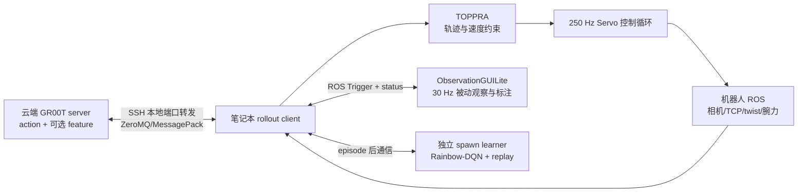

# GR00T 双臂实机 Rollout 与 Speed-RL 在线训练完整教程

本文档对应当前仓库的 `agent/export-action-features` 分支，覆盖以下完整链路：

- 云端 GR00T 推理 server 输出 action，以及 Speed-RL 所需的中间特征；
- 笔记本通过 SSH 隧道访问云端 server；
- 笔记本接入机器人 ROS，使用 TOPPRA 生成双臂连续轨迹并以 250 Hz 执行；
- 使用 ObservationGUILite 查看 rollout、控制 episode、记录数据并人工标注结果；
- 完成四档速度标定、Rainbow-DQN 在线训练、greedy 验收和异步接入。

本文不是机器人硬件认证文件。文中的软件默认值不等于硬件安全上限；真实速度阈值、碰撞限制、
工作空间、Servo 参数和急停流程必须由机器人负责人确认。

## 1. 先理解当前系统边界

### 1.1 运行架构



职责必须保持清晰：

| 组件 | 运行位置 | 职责 | 不负责的内容 |
| --- | --- | --- | --- |
| GR00T server | 云端 GPU | VLA 推理，输出 40 个 action waypoint；启用 feature 模式时额外输出 action-token feature | ROS、TOPPRA、Servo、Speed-RL 训练 |
| rollout client | 机器人笔记本 | ROS 观测、TOPPRA、episode 状态机、250 Hz 目标发布、日志 | 加载云端 VLA 模型 |
| Speed-RL actor | rollout 进程的 CPU | 每次新轨迹规划前选择一个速度档 | 不在 250 Hz 循环里训练 |
| Rainbow learner | 笔记本独立 spawn 进程 | replay、网络更新、checkpoint | episode 内不热更新 actor |
| ObservationGUILite | 笔记本本机 Python（可选 Docker） | 被动显示、30 Hz 数据记录、按钮和人工标签 | 绝不能再运行自己的 GR00T 控制循环 |

整个系统中只能有一个进程发布双臂 Servo 和手部命令：Isaac-GR00T 的 rollout client。

### 1.2 相关代码入口

| 文件或目录 | 用途 |
| --- | --- |
| [`rollout/launch.sh`](rollout/launch.sh) | 推荐的统一启动脚本 |
| [`rollout/rollout.env.example`](rollout/rollout.env.example) | 笔记本统一配置模板 |
| [`rollout/plain_client.py`](rollout/plain_client.py) | 普通同步/异步 TOPPRA 实机 rollout |
| [`rollout/observation.py`](rollout/observation.py) | 本 checkpoint 所需 ROS 观测和 stale 规则 |
| [`rollout/hardware_safety.py`](rollout/hardware_safety.py) | 工作空间、目标跟踪误差和伪相机实机门禁 |
| [`rollout/operator.py`](rollout/operator.py) | GUI/ROS episode 服务桥接 |
| [`rollout/observation_gui/`](rollout/observation_gui/) | ObservationGUILite 被动模式 overlay |
| [`speed_rl/agent.py`](speed_rl/agent.py) | 速度决策、feature 对齐、轨迹激活事件 |
| [`speed_rl/client.py`](speed_rl/client.py) | 标定/在线/greedy 状态机 |
| [`speed_rl/learner.py`](speed_rl/learner.py) | 独立训练进程、checkpoint 和 actor 权重快照 |
| [`speed_rl/safety.py`](speed_rl/safety.py) | 实测 twist 连续越限监控和 action mask |
| [`speed_rl/phases.py`](speed_rl/phases.py) | 标定、默认 100 episode 预算和 5 episode 验收 |
| [`eval_toppra_bimanual.py`](eval_toppra_bimanual.py) | 冻结的 TOPPRA 同步/异步基础实现 |
| [`kion_client/`](kion_client/) | 冻结的 Kion ROS 类型、Servo 和 tracking 实现 |
| [`../../run_gr00t_server.py`](../../run_gr00t_server.py) | 云端 server 主入口 |
| [`../../../policy/gr00t_policy.py`](../../../policy/gr00t_policy.py) | action 和 feature 响应协议 |
| [`../../../../examples/naviai_wa1_head_lr_wf/`](../../../../examples/naviai_wa1_head_lr_wf/) | 当前 checkpoint 的 server 配置与启动脚本 |

`eval_toppra_bimanual.py` 和 `kion_client/` 是冻结基线。Speed-RL 通过继承复用它们，不维护
另一份完整 rollout 副本。

## 2. 当前 checkpoint 与 feature 契约

当前 `parcel_4f_v5.9` checkpoint 使用：

| 模态 | keys |
| --- | --- |
| video | `head`, `left`, `right` |
| state | `left_tcp`, `left_wrist_force`, `right_tcp`, `right_wrist_force` |
| action | `left_delta_tcp`, `left_pinch`, `right_delta_tcp`, `right_pinch` |
| language | `annotation.human.task_description` |
| action horizon | 40 |

Speed-RL 选择的特征 A 为：

```text
action_head.dit.last_block.pre_output_norm.final_denoise
```

它的精确定义是：最后一次 action 去噪时，最后一个 DiT block 输出的 action token，位置在
`norm_out`、timestep modulation 和最终 action projection 之前。server 返回：

```python
actions, info = get_action(...)

info["speed_rl"]["action_features"]  # float32, [K, H, D]
info["speed_rl"]["contract"] = {
    "version": 1,
    "model_id": "parcel_4f_v5.9",
    "layer": "action_head.dit.last_block.pre_output_norm.final_denoise",
    "feature_dim": 1536,
    "dtype": "float32",
}
```

对当前模型，通常有：

```text
K = TTS candidate 数
H = 40 个 action waypoint
D = 1536
```

`K=1` 时 feature payload 为 `1 × 40 × 1536 × 4 = 245,760` bytes；action payload 约为
2,240 bytes。启用 feature 会增加传输量，但不会把一个正常的百毫秒级请求单独变成十几秒。
`TTS_SAMPLES=4/8` 会扩大 batch、候选规划量和 payload，因此正常同步 rollout 必须保持 1。

普通 rollout 不依赖这个 feature。如果只测普通 rollout 的最低延迟，可以启动不带
`--speed-rl-features` 的 action-only server；如果连接的是 feature server，普通 client 会忽略
feature，但 server 仍会生成和传输它。

## 3. 实机前的安全红线

满足以下条件前只允许 `DRY_RUN=1`：

- 急停、硬件 watchdog、碰撞保护和关节限位均有效；
- 操作人员站位安全，能够立即急停；
- 机器人上没有另一个节点同时发布 `/zj_humanoid/upperlimb/servol/dual_arm`；
- 厂商授权工具和 Kion/ZJ Humanoid SDK 已正确安装；
- ROS Master、消息类型、topic、service 和时间戳已经确认；
- 左右臂工作空间和初始姿态适合当前任务；
- 左右臂基坐标系工作空间和最大位置/旋转跟踪误差已经书面确认并写入配置；
- 三路相机均为 checkpoint 对应的真实视角；伪腕相机只允许 dry-run；
- TOPPRA 速度/加速度约束已经过硬件负责人确认；
- Speed-RL 的左右臂六分量实测 twist 阈值已经书面确认；
- 第一次物理测试关闭夹爪：`DISABLE_PINCH=1`；
- 已先完成普通同步 rollout，再考虑异步或 Speed-RL。

Speed-RL 的 twist 越限监控只改变 episode 标签，不能代替急停或 watchdog。独立的 Cartesian
target guard 会在目标越界或跟踪误差过大时、Servo publish 之前关闭当前 episode 的 Servo。

## 4. 两台机器检出完全相同的代码

云端和笔记本必须使用同一个 commit，不能只说“同一个分支”。当前 fork 和分支为：

```bash
git clone --branch agent/export-action-features \
  https://github.com/knanxu/Isaac-GR00T.git
cd Isaac-GR00T
git rev-parse HEAD
```

在两台机器上记录同一个 commit：

```bash
git fetch fork
git switch agent/export-action-features
git pull --ff-only fork agent/export-action-features
git rev-parse HEAD
```

如果本地分支存在尚未 push 的 commit，新的笔记本或云端 clone 不会得到这些代码。部署前必须
先确认目标 commit 已经存在于 fork，再让两台机器检出该 commit。

不要提交以下内容：

- checkpoint；
- `server.local.env`、`rollout.local.env`；
- Hugging Face token；
- `logs/` 下的实机数据和 Speed-RL 状态。

## 5. 云端部署 GR00T server

### 5.1 安装环境

在云端项目根目录执行：

```bash
bash scripts/deployment/dgpu/install_deps.sh
source .venv/bin/activate
```

当前 dGPU 安装器默认允许跳过无法从 GitHub Release 下载的 `flash-attn`，模型会回退到
PyTorch SDPA。若云端能访问对应 wheel，才显式使用 `INSTALL_FLASH_ATTN=1`。

checkpoint 会加载 gated Hugging Face backbone `nvidia/Cosmos-Reason2-2B`。必须先获得访问权并
登录：

```bash
hf auth login
```

### 5.2 检查 checkpoint

假设 checkpoint 位于：

```text
/path/to/Isaac-GR00T/parcel_4f_v5.9
```

至少检查：

```bash
MODEL_DIR=/path/to/Isaac-GR00T/parcel_4f_v5.9
test -f "$MODEL_DIR/config.json"
test -f "$MODEL_DIR/processor_config.json"
test -f "$MODEL_DIR/statistics.json"
test -f "$MODEL_DIR/embodiment_id.json"
test -f "$MODEL_DIR/model.safetensors.index.json"
find "$MODEL_DIR" -maxdepth 1 -name '*.safetensors' -type f -print
```

### 5.3 启动 feature server

```bash
cp examples/naviai_wa1_head_lr_wf/server.env.example server.local.env
sed -i \
  's|/absolute/path/to/parcel_4f_v5.9|/path/to/Isaac-GR00T/parcel_4f_v5.9|' \
  server.local.env
```

使用 SSH 隧道时，建议把 `server.local.env` 中的监听地址改为：

```text
SERVER_BIND_HOST=127.0.0.1
```

然后启动：

```bash
bash examples/naviai_wa1_head_lr_wf/launch_feature_server.sh server.local.env
```

预期看到：

```text
Speed-RL features: True
Server ready ... listening on tcp://127.0.0.1:47866
```

另一个云端终端可检查：

```bash
ss -lntp | grep 47866
nvidia-smi
```

### 5.4 只启动 action-only server

普通同步/异步 rollout 不需要中间特征。若要隔离 feature 的计算和传输影响，可重启为：

```bash
.venv/bin/python -m gr00t.eval.run_gr00t_server \
  --model-path /path/to/Isaac-GR00T/parcel_4f_v5.9 \
  --embodiment-tag naviai_wa1_head_lr_wf \
  --device cuda \
  --host 127.0.0.1 \
  --port 47866
```

action-only server 可以运行普通 rollout，但 Speed-RL 会因为缺少
`get_speed_rl_contract` endpoint 而 fail-closed。

## 6. 笔记本建立 SSH 隧道并测试 server

准备好无影云的 SSH 主机、端口和用户名后，在笔记本单独保留一个终端运行：

```bash
ssh -N \
  -o ExitOnForwardFailure=yes \
  -o ServerAliveInterval=30 \
  -o ServerAliveCountMax=3 \
  -L 47866:127.0.0.1:47866 \
  -p <SSH_PORT> <CLOUD_USER>@<CLOUD_HOST>
```

笔记本所有 client 都连接 `127.0.0.1:47866`，不再经过 Tailscale。检查本地监听：

```bash
ss -lntp | grep 47866
```

### 6.1 feature server 的合成请求测试

此测试不连接 ROS，也不移动机器人：

```bash
.venv/bin/python -m gr00t.eval.real_robot.TOPPRA.speed_rl.probe_server \
  --server-host 127.0.0.1 \
  --server-port 47866 \
  --tts-samples 1 \
  --requests 10 \
  --warmup-requests 2 \
  --task "move parcel onto conveyor belt one by one"
```

必须同时确认：

- `status` 是 `ok`；
- action 的 candidate 数为 1、horizon 为 40；
- feature shape 为 `[1, 40, 1536]`；
- contract 的 model、layer、dim 和 dtype 完全一致；
- P95/max 小于 client 的 `TIMEOUT_MS`；
- 没有偶发十几秒超时。

本项目此前通过该直连 SSH 隧道测得过约 164 ms median、183 ms P95 的端到端结果；这只是一次
环境记录，不是永久保证，正式 rollout 前必须重测。`MAX_LATENCY_S` 应根据当前 P99 配置。

若请求仍是十几秒，依次排查：GPU 是否正在争用、server 是否每次重新加载模型、SSH 是否直连、
图像预处理、模型前向以及 response 序列化。`probe_server` 给出的是端到端时间，不能单独证明
“传输占大部分时间”。

## 7. 笔记本安装 Isaac-GR00T、厂商 SDK 和 ROS

### 7.1 项目环境

```bash
cd /path/to/Isaac-GR00T
uv sync --all-extras
source .venv/bin/activate
```

### 7.2 厂商授权与 ROS workspace

实机部署顺序应为：

1. 按机器人厂商文档安装并验证授权工具；
2. 安装或初始化 ZJ Humanoid/Kion SDK；
3. 编译包含私有 message/service 的 catkin workspace；
4. source ROS Noetic 和机器人 workspace；
5. 配置 ROS 网络；
6. 最后启动 rollout。

代码不会替代授权工具，也不会自动安装私有 ROS message/service。

示例：

```bash
source /opt/ros/noetic/setup.bash
source /absolute/path/to/robot_ws/devel/setup.bash
export ROS_MASTER_URI=http://ROBOT_IP:11311
export ROS_IP=LAPTOP_ROBOT_NETWORK_IP
```

`ROS_IP` 必须是笔记本连接机器人网络的本机 IPv4，不是机器人 IP。检查：

```bash
ip -4 -br address
echo "$ROS_MASTER_URI"
echo "$ROS_IP"
rostopic list
rosservice list
```

确认当前 `.venv` 能导入 ROS/Kion 类型：

```bash
.venv/bin/python -c \
  "from gr00t.eval.real_robot.TOPPRA.kion_client.client import load_ros_types; print(load_ros_types())"
```

### 7.3 必需 ROS 数据

rollout 启动前必须持续收到：

| 数据 | 默认 topic |
| --- | --- |
| 左腕图像 | `/zj_humanoid/sensor/left_wrist/image_raw/compressed` |
| 右腕图像 | `/zj_humanoid/sensor/right_wrist/image_raw/compressed` |
| 头部图像 | `/zj_humanoid/sensor/realsense_head/color/image_raw/compressed` |
| 左 TCP pose | `/zj_humanoid/upperlimb/tcp_pose/left_arm` |
| 右 TCP pose | `/zj_humanoid/upperlimb/tcp_pose/right_arm` |
| 双臂 TCP twist | `/zj_humanoid/upperlimb/tcp_speed/dual_arm` |
| 左腕补偿力 | `/wrist_force_control/left_arm_compensated_force` |
| 右腕补偿力 | `/wrist_force_control/right_arm_compensated_force` |

Finger pressure 仍被基础 buffer 订阅，但不是当前 checkpoint 输入，也不会阻塞 unified rollout
ready。检查频率和类型：

```bash
rostopic hz /zj_humanoid/sensor/realsense_head/color/image_raw/compressed
rostopic hz /zj_humanoid/upperlimb/tcp_pose/left_arm
rostopic hz /zj_humanoid/upperlimb/tcp_pose/right_arm
rostopic hz /zj_humanoid/upperlimb/tcp_speed/dual_arm
rostopic hz /wrist_force_control/left_arm_compensated_force
rostopic hz /wrist_force_control/right_arm_compensated_force
```

执行模式还需要：

```text
topic:   /zj_humanoid/upperlimb/servol/dual_arm
service: /zj_humanoid/upperlimb/set_servo_params
service: /zj_humanoid/upperlimb/clear_servo_params
```

启用 pinch 时还需要：

```text
/zj_humanoid/hand/joint_switch/left
/zj_humanoid/hand/joint_switch/right
```

第一轮实机验证保持 `DISABLE_PINCH=1`。

## 8. ObservationGUILite：需要单独安装，但不能单独控制机器人

Isaac-GR00T 仓库只包含 ObservationGUILite 的集成 overlay，不包含完整 GUI 项目。因此：

- 使用 `CONTROL_INTERFACE=terminal` 时，不需要安装 ObservationGUILite；
- 需要图形化观察和 LeRobot episode 记录时，必须另行准备
  与 Isaac-GR00T 同级的 `ObservationGUILite-v1.0.0`，或显式设置 `OBSERVATION_GUI_ROOT`；
- 不要直接运行原 GUI 的 GR00T inference/training 控制模式；应运行本仓库的 overlay。

如果 GUI 是从 Git 仓库 clone 的，先执行：

```bash
cd /path/to/ObservationGUILite-v1.0.0
git submodule update --init --recursive
```

如果当前目录是解压包而不是 Git 仓库，至少检查：

```bash
GUI_ROOT=/path/to/ObservationGUILite-v1.0.0
test -f "$GUI_ROOT/build/lerobot/pyproject.toml"
test -f "$GUI_ROOT/build/zj_humanoid_sdk_ros/api_struct/zj_humanoid_types_25_R3.run"
test -x "$GUI_ROOT/deploy.sh"
```

默认使用本机 Python 3.12 GUI，先安装两个 GUI-only wheel：

```bash
cd /path/to/Isaac-GR00T
uv pip install --python .venv/bin/python --no-deps av==15.1.0 dearpygui==2.0.0
echo "$DISPLAY"
ls -l /tmp/.X11-unix
```

受限网络推荐 `OBSERVATION_GUI_RUNTIME=native`。只有确实需要原容器环境且 Docker Registry、
Astral/GitHub 均可访问时才使用 `OBSERVATION_GUI_RUNTIME=docker`。

先启动 rollout client，再在另一个终端启动 GUI overlay：

```bash
export ROS_MASTER_URI=http://ROBOT_IP:11311
export ROS_IP=LAPTOP_ROBOT_NETWORK_IP
export DISPLAY=:0

cd /path/to/Isaac-GR00T
bash gr00t/eval/real_robot/TOPPRA/rollout/launch_gui.sh rollout.local.env
```

overlay 会复制必要文件到：

```text
logs/observation_gui_rollout/app/
```

默认由本机 `.venv` 启动只读控制模式。GUI 只调用
`/gr00t_rollout/{start,success,failure,abort,approve}`，显示 `/gr00t_rollout/status`，同时在 30 Hz
被动记录；250 Hz 运动控制始终归 rollout client 所有。

## 9. 创建统一的笔记本配置

在 Isaac-GR00T 根目录：

```bash
cp gr00t/eval/real_robot/TOPPRA/rollout/rollout.env.example rollout.local.env
```

首先填写：

```text
PYTHON_BIN=.venv/bin/python
ROS_SETUP=/opt/ros/noetic/setup.bash
ROBOT_ROS_SETUP=/absolute/path/to/robot_ws/devel/setup.bash

POLICY_SERVER_HOST=127.0.0.1
POLICY_SERVER_PORT=47866
TASK="move parcel onto conveyor belt one by one"

ROLLOUT_MODE=plain
INFERENCE_MODE=sync
CONTROL_INTERFACE=both
OBSERVATION_GUI_ROOT=/path/to/ObservationGUILite-v1.0.0
OBSERVATION_GUI_RUNTIME=native
TTS_SAMPLES=1
DRY_RUN=1
DISABLE_PINCH=1
```

`CONTROL_INTERFACE` 的选择：

| 值 | 用途 |
| --- | --- |
| `terminal` | 不安装 GUI；在 client 终端输入命令 |
| `gui` | 只使用 ObservationGUILite 按钮 |
| `both` | 推荐调试模式；GUI 观察，同时保留带文字备注的终端命令 |

普通 TOPPRA 模板中的 `1.0/3.0/5.0/15.0` 和 `SAFETY_MARGIN=0.9` 是软件默认值，不代表
已经通过硬件确认。`DRY_RUN=0` 前必须修改为实际批准值。普通模式最终约束是配置值乘以
`SAFETY_MARGIN`。

真实运动前还必须填写，不能使用猜测值：

```text
LEFT_WORKSPACE_BOUNDS=xmin,xmax,ymin,ymax,zmin,zmax
RIGHT_WORKSPACE_BOUNDS=xmin,xmax,ymin,ymax,zmin,zmax
MAX_TARGET_POSITION_ERROR_M=...
MAX_TARGET_ROTATION_ERROR_RAD=...
```

## 10. 第一级验证：无运动 dry-run

保持：

```text
ROLLOUT_MODE=plain
INFERENCE_MODE=sync
TTS_SAMPLES=1
DRY_RUN=1
DISABLE_PINCH=1
```

启动：

```bash
cd /path/to/Isaac-GR00T
bash gr00t/eval/real_robot/TOPPRA/rollout/launch.sh rollout.local.env
```

dry-run 仍会：

- 订阅真实 ROS observation；
- 调用云端 server；
- 运行 TOPPRA；
- 运行 250 Hz client 循环；
- 写 tracking 和 outcome；
- 接受 GUI/terminal episode 命令。

dry-run 不会配置 Servo，也不会发布双臂目标。输入 `start` 或按 GUI 的 Start 后，检查：

- 首次 observation ready 没有缺字段；
- action 推理成功；
- TOPPRA `plan_success`；
- `active_sequence_id` 开始变化；
- `active_buffer_size` 正常消耗；
- 没有 `critical_observation_stale_hold`；
- 没有 `planning_failed`、`latest_error` 或 `finalization_error`。

终端命令：

```text
start
status
success
failure
abort
quit
```

也可以从 ROS 调用：

```bash
rosservice call /gr00t_rollout/start "{}"
rostopic echo -n 1 /gr00t_rollout/status
rosservice call /gr00t_rollout/success "{}"
```

运行状态下 `quit` 会被拒绝，必须先 `success`、`failure` 或 `abort`。

## 11. 第二级验证：普通同步 TOPPRA 实机 rollout

同步模式的行为是：轨迹执行完后保持最后目标，后台完成下一次推理和 TOPPRA 规划，轨迹真正
ready 后再激活执行。推理期间不会阻塞 250 Hz 控制循环。

### 11.1 启动前设置

```text
ROLLOUT_MODE=plain
INFERENCE_MODE=sync
TTS_SAMPLES=1
DRY_RUN=0
DISABLE_PINCH=1
```

把以下普通约束替换为硬件确认值：

```text
MAX_LINEAR_VELOCITY=...
MAX_ANGULAR_VELOCITY=...
MAX_LINEAR_ACCELERATION=...
MAX_ANGULAR_ACCELERATION=...
SAFETY_MARGIN=...
LEFT_WORKSPACE_BOUNDS=...
RIGHT_WORKSPACE_BOUNDS=...
MAX_TARGET_POSITION_ERROR_M=...
MAX_TARGET_ROTATION_ERROR_RAD=...
```

若 `rollout.mock_inputs` 仍在发布伪腕相机，客户端会拒绝真实运动。先 Ctrl-C 停止伪相机，并
确认左右腕真实相机的 ROS publisher、分辨率、方向和 checkpoint 训练配置一致。

不要把示例值称为“经过硬件确认的约束”。确认 `/set_servo_params` 的以下代码参数与机器人 SDK
定义一致：

```text
time = 1 / CONTROL_FREQUENCY
lookahead_time = 0.2
gain = SERVO_GAIN（默认 800，SDK 校验范围 100..1000）
v = 0
acc = 0
arm_type = 0
```

### 11.2 单个 episode 的操作顺序

1. 确认机器人初始姿态、场景和急停。
2. 启动 client，等待 `client ready`。
3. 启动 ObservationGUILite overlay，确认画面和 status 正常。
4. 点击 Start 或输入 `start`；此时才创建并配置 Servo。
5. 全程观察双臂、buffer、推理/规划延迟和 tracking error。
6. 任务完成时点击 Success；任务未完成但机器人仍安全时点击 Failure。
7. 出现危险、碰撞倾向或控制异常时使用 Abort/急停；`abort` 会关闭当前 Servo。
8. 等待 `finalization_in_progress=false`，点击 `Reset / Release Servo`。
9. 按配置进行人工复位，或等待厂商双臂 home 请求返回；人工摆好任务物体并确认机械臂到位。
10. 点击 `Reset Complete / Ready`；只有状态回到 `idle` 才能开始下一次。

`success`/`failure` 会停止消费新轨迹，但继续发布最后一个 target pose。`abort` 会立即关闭本次
Servo 和 pinch executor。完成 `reset -> ready` 后，下一次 `start` 才会重新创建并配置 Servo。

默认 `RESET_MODE=manual`：`reset` 只释放 Servo/pinch，机器人不会自行运动。经过机器人负责人
单独验证后可设 `RESET_MODE=go-home`，此时释放 Servo 后调用
`/zj_humanoid/upperlimb/go_home/dual_arm`（`std_srvs/Trigger`）。Trigger success 仅代表请求被接受，
不代表已到位；包裹等任务场景也不会自动复位，所以仍必须由操作员点击 `ready`。

至少完成若干个同步 plain episode，并人工确认：

- 无 abort、无控制 fault；
- 相机/TCP/腕力没有 critical stale；
- 实际姿态平滑跟踪目标；
- tracking CSV 无丢行或异常 deadline；
- 云端延迟稳定；
- 任务成功率可接受。

## 12. 第三级验证：原始异步 TOPPRA rollout

必须先通过普通同步实机验证。异步模式仍使用冻结基础实现，不需要 Speed-RL feature。

配置：

```text
ROLLOUT_MODE=plain
INFERENCE_MODE=async
TTS_SAMPLES=1
DRY_RUN=0
```

关键参数：

```text
MAX_LATENCY_S=<当前 server+网络端到端 P99，单位秒，向上留余量>
SCHEDULING_MARGIN_S=0.05
HANDOFF_MARGIN_S=0.05
REFILL_THRESHOLD=20
OPEN_LOOP_HORIZON=8
```

异步流程为：

1. 旧 TOPPRA 轨迹继续执行；
2. buffer 剩余时间进入 `MAX_LATENCY + scheduling margin + handoff margin`，或 open-loop waypoint
   达到门槛时，请求新 action；
3. 推理返回后，在旧轨迹未来采样点预约 handoff；
4. 丢弃新 action 中 handoff 前已经错过的 waypoint；
5. 以预约点的 pose/twist 规划新轨迹；
6. 仅在 source sequence 未变化、handoff 没错过且连续性检查通过时激活；
7. 否则丢弃新轨迹，继续旧轨迹或保持最后 target。

验收日志中重点搜索：

```bash
rg 'handoff_|buffer_underflow|planning_failed|trajectory_ready|plan_success' rollout.log
```

不允许出现持续 underflow、大量 `handoff_missed`、`handoff_discontinuous` 或 source changed。
完成实机复核后，由负责人手工创建异步证据文件，例如：

```json
{
  "raw_async_rollout_verified": true,
  "speed_rl_async_greedy_verified": false,
  "reviewed_by": "operator-name",
  "evidence": "absolute/path/to/review-report.md"
}
```

这个 JSON 只是软件门禁声明，不会自动分析实机是否真的安全。

## 13. Tracking 日志与人工复核

普通模式默认输出：

```text
logs/kion_rollout/<timestamp>_episode_NNN/
  metadata.json
  tcp_tracking.csv
  outcome.json
```

Speed-RL 默认输出：

```text
logs/kion_speed_rl/episodes/<timestamp>_episode_NNN/
  metadata.json
  tcp_tracking.csv
  outcome.json
```

`tcp_tracking.csv` 每个发布周期记录：

- 控制循环起止、deadline lateness；
- active sequence 和 buffer；
- 左右目标/实测 pose；
- 左右实测六维 twist；
- 左右位置误差和旋转误差；
- ROS/monotonic 时间戳。

可使用仓库中的延迟估计函数：

```bash
TRACKING_CSV=/absolute/path/to/tcp_tracking.csv \
.venv/bin/python - <<'PY'
import json
import os
from dataclasses import asdict
from gr00t.eval.real_robot.TOPPRA.kion_client.tracking import estimate_tracking_delay

path = os.environ["TRACKING_CSV"]
for arm in ("left", "right"):
    print(json.dumps(asdict(estimate_tracking_delay(path, arm)), indent=2))
PY
```

人工批准一个速度前，至少检查：

- `tracking_dropped_rows == 0`；
- 控制频率和 pose feedback 频率合理；
- P99/max loop duration 与 deadline lateness；
- 目标/实测位置和旋转误差；
- 六维 twist 是否接近或超过认证阈值；
- 是否发生 underflow、hold、stale、规划失败或控制 fault；
- 机器人、物体和环境视频是否正常。

ObservationGUILite 的 30 Hz 数据默认写到：

```text
logs/observation_gui_rollout/app/datasets/parcel_rollout_view/
```

Start 后自动开始被动记录；Success/Failure 保存并写外部 outcome 事件；Abort 丢弃 GUI episode。
250 Hz tracking CSV 才是控制和安全复核的主要证据，不能只看 GUI 视频。

## 14. Speed-RL 策略到底学什么

Speed-RL 不修改 GR00T 输出的空间 waypoint，只为每条真正准备执行的 TOPPRA 轨迹选择一个速度档：

```text
action 0 -> scale 0.7
action 1 -> scale 1.0
action 2 -> scale 1.3
action 3 -> scale 1.6
```

每档实际 TOPPRA 约束为：

```text
velocity     = [1, 1, 1, 3, 3, 3] * scale
acceleration = [5, 5, 5, 15, 15, 15] * scale^2
safety_margin = 1.0
```

| scale | 线速度 | 角速度 | 线加速度 | 角加速度 |
| ---: | ---: | ---: | ---: | ---: |
| 0.7 | 0.7 | 2.1 | 2.45 | 7.35 |
| 1.0 | 1.0 | 3.0 | 5.00 | 15.00 |
| 1.3 | 1.3 | 3.9 | 8.45 | 25.35 |
| 1.6 | 1.6 | 4.8 | 12.80 | 38.40 |

单位分别应与机器人 TCP 线速度、角速度、线加速度、角加速度定义一致。这里没有父类的 0.9
safety margin。这四档全部需要硬件认证，尤其不能因为 0.7 是最低档就默认它一定安全。

GR00T 返回 40 点 chunk；TOPPRA 在规划前只保留前 30 点，完整执行重定时后的连续轨迹，然后
丢弃最后 10 点并重新推理。`scale` 只表示 TOPPRA Cartesian constraint scale，不等于 baseline
每个 30 Hz 时刻推进的 action index 数。

feature 和 action waypoint 始终一一对齐。异步 stale 裁剪 action 时同步裁剪 feature，然后对
当前仍有效的整个 feature chunk 做 mean-pool，得到 1536 维、与 speed action 无关的 state。
TOPPRA 的 30 点执行裁剪不再裁剪 feature，后 10 点作为 VLA 的未来计划上下文。feature 缺失、
shape 错误、horizon 不是 40 或 checkpoint contract 不一致都会 fail-closed。

Rainbow-DQN 固定配置：

| 项目 | 值 |
| --- | --- |
| 网络 | running mean/std 归一化，隐藏层 256×256×256，NoisyNet Dueling C51 |
| TOPPRA 输出 | `[batch, 4, 121]` |
| baseline 输出 | `[batch, 7, 121]` |
| 默认 C51 support | TOPPRA `[0,180]`；baseline `[0,500]`（根据 episode/v 上限自动取整） |
| Double-DQN | 启用 |
| return loss | 1-step + 3-step |
| gamma | 0.99 |
| learning rate | `1e-4` |
| target soft update | 每 50 update，`tau=0.5` |
| max grad norm | 10 |
| batch / learning starts | 128 / 128 |
| replay capacity | 20,000 |
| PER alpha | 0.2 |
| PER beta | 0.6 → 1.0，源项目 legacy update |
| epsilon | 0；探索来自 NoisyNet |

actor 只做一次轻量 CPU 前向；learner 在独立 multiprocessing `spawn` 进程训练。每次 `start`
安装最新 learner 权重并采样一次 NoisyNet，episode 内 actor 权重和噪声均冻结。hidden 默认 256，
可通过 `RAINBOW_HIDDEN_DIM` 修改。

### 14.1 SpeedTuning 插值 baseline

项目还提供 `ROLLOUT_MODE=speed-rl-baseline` 作为 TOPPRA-SpeedRL 的对比。它使用独立七档
`v=[1.0,1.5,...,4.0]`。每次重新推理 40 点 chunk，只按 `0,v,...,9v` 生成和执行
`k_skip=10` 个 target，随后丢弃该 chunk 的余下 action。TCP 欧拉角增量先累积成 SE(3) 路径，
平移线性插值、姿态沿最短旋转弧插值。target 以 30 Hz 更新，Servo owner 仍以 250 Hz 重复发布。

```text
ROLLOUT_MODE=speed-rl-baseline
INFERENCE_MODE=sync
TTS_SAMPLES=1
BASELINE_ACTION_FREQUENCY=30
BASELINE_K_SKIP=10
BASELINE_SPEED_MIN=1.0
BASELINE_SPEED_MAX=4.0
BASELINE_SPEED_STEP=0.5
```

baseline 默认使用独立的 `logs/kion_speed_rl_baseline/` replay/checkpoint，不能和 TOPPRA 模式
混用。它不提供 TOPPRA 速度/加速度保证，必须独立做七档硬件标定。0.333 s 执行窗口短于云端
推理延迟时会产生 hold，代码不会通过执行更多旧 action 来掩盖。完整设计和命令见
[`speed_rl/INTERPOLATION_BASELINE.md`](speed_rl/INTERPOLATION_BASELINE.md)。

## 15. Speed-RL safety threshold 的配置

统一配置必须填写：

```text
LEFT_TWIST_THRESHOLDS=VX,VY,VZ,WX,WY,WZ
RIGHT_TWIST_THRESHOLDS=VX,VY,VZ,WX,WY,WZ
```

必须确认 `TcpSpeed` 原始六分量的顺序和单位与上述顺序一致。代码不做单位转换。阈值应来自：

- 厂商硬件上限和控制器定义；
- 机器人负责人批准的实验上限；
- 普通同步低速 rollout 的实测 tracking 数据；
- 留有安全裕度的最终认证记录。

不要直接从 TOPPRA 规划上限复制阈值，也不要使用猜测值。

在 250 Hz 下，任一手臂任一分量连续 100 个有效帧严格超过阈值时，约 0.4 秒后锁存
`speed_violation=true`。某分量恢复到阈值内，它自己的连续计数归零。twist stale 时所有计数
归零，并把 action mask 改为：

```text
[True, True, False, ...]
```

即只允许当前 backend 的前两个最低档。TOPPRA 默认是 0.7/1.0；baseline 默认是 1.0/1.5。
twist stale 不会中止普通轨迹；TOPPRA 会回退到 commanded twist 估计。

## 16. Speed-RL dry-run

先确认云端运行 feature server，然后修改：

```text
ROLLOUT_MODE=speed-rl
INFERENCE_MODE=sync
SPEED_RL_PHASE=calibration
TTS_SAMPLES=1
DRY_RUN=1
DISABLE_PINCH=1
LEFT_TWIST_THRESHOLDS=<六个已确认正数>
RIGHT_TWIST_THRESHOLDS=<六个已确认正数>
```

启动：

```bash
bash gr00t/eval/real_robot/TOPPRA/rollout/launch.sh rollout.local.env
```

启动时 client 会先发现 server contract，随后才初始化 ROS 和 learner。检查 status：

```bash
rostopic echo -n 1 /gr00t_rollout/status
```

至少确认：

- `mode=speed-rl`；
- contract 自动发现成功；
- `phase=calibration`；
- `speed_action=0`、`speed_scale=0.7`；
- `policy_version`、`replay_size` 和 `replay_action_counts` 可见；
- feature/action 没有对齐错误；
- episode 结束后生成 `outcome.json` 和 checkpoint。

每个 episode 只把真正激活执行的 trajectory decision 写入 replay。TOPPRA 规划失败、异步 handoff
错过、source 改变、episode reset 后晚到的 response 和从未激活的轨迹都会被丢弃。

## 17. 四档同步标定：8 个有效 episode

标定必须使用：

```text
SPEED_RL_PHASE=calibration
INFERENCE_MODE=sync
```

固定顺序为：

```text
0.7 × 2 个有效 episode -> 人工批准
1.0 × 2 个有效 episode -> 人工批准
1.3 × 2 个有效 episode -> 人工批准
1.6 × 2 个有效 episode -> 人工批准
```

“有效”在当前代码中的精确定义是：

- 没有 abort；
- 没有 control fault；
- 至少有一个真正 activated transition。

注意：代码层面的 `valid_for_calibration` 不要求任务 success，也不会因为 speed violation 自动
判无效。因此操作规程应更严格：发生 tracking 异常、任务失败或 speed violation 时不要批准
该速度，并停止继续开放高档位。

每个档位的操作：

1. `start`，确认 status 的 fixed speed 正确。
2. 完成任务后标记 Success/Failure；危险情况 Abort。
3. 等待 finalization 完成。
4. 执行 `reset`，确认机械臂和场景复位后执行 `ready`。
5. 重复第二个有效 episode。
6. 此时 `calibration.awaiting_approval=true`，不能继续 Start。
7. 审阅两份 tracking CSV、视频和 outcome。
8. 使用带证据的终端命令批准：

```text
approve /absolute/path/to/speed_0.7_tracking_review.md
```

GUI 的 Approve 按钮会记录通用备注 `ObservationGUILite operator approval`，没有路径输入框。为保证
可追溯性，建议标定时使用 `CONTROL_INTERFACE=both`，并从终端执行带报告路径的 `approve`。

当前状态机会在任一 abort/control fault 后写入 `stopped=true`，没有自动恢复命令；也没有
“拒绝当前两次标定并重做”的命令。不要手工编辑 `calibration.json` 来绕过此门槛，应先复盘并
完善状态机或按正式重置流程重新开始实验。

## 18. 标定完成后必须检查 replay gate

标定完成不等于在线训练一定能开始。当前在线 gate 要求：

```text
replay_size >= max(batch_size, learning_starts) = 128
```

从 GUI、terminal `status` 或 ROS status 检查：

```text
replay_size
replay_action_counts
online_training_ready
```

8 个 TOPPRA 标定 episode（baseline 为 14 个）能否满足 gate，取决于每个 episode 真正激活了
多少条轨迹，不能只按 episode 数推断。`replay_action_counts` 仍用于检查覆盖情况，但不再是代码
层面的 32-per-speed gate。

当前第一版有一个明确待办：标定一旦每档完成两次就进入 approval，但尚无独立的 replay 导入/
补采命令。如果标定完成后 gate 仍是 false，当前代码不能直接开始 online。此时必须停止实机
训练，先实现并验证明确的 replay 补齐或离线导入流程；不要伪造 checkpoint、复制 transition、
手改 `calibration.json` 或降低 gate。

另一个需要实验负责人确认的行为是：标定阶段只写 replay 和 checkpoint，不执行网络更新。因此
第一个 online episode 使用的是尚未经过训练的随机初始化 Q 网络（再叠加 epsilon 探索），只是
四个可选速度都已经完成硬件标定。若不接受这一行为，应在实机 online 前增加“使用标定 replay
做初始训练并保存 policy version”的显式步骤和测试。online 探索使用 episode 开始时冻结的
NoisyNet sample，不使用 epsilon-greedy。

## 19. 默认 100 个同步在线训练 episode

只有以下条件全部成立才开始：

- 当前 backend 的全部速度标定完成并有人工批准证据；
- `online_training_ready=true`；
- 所有配置速度已经通过硬件认证；
- checkpoint contract 与当前 server 完全一致；
- 负责人接受第一个 online policy 的初始化方式。

停止 client，修改：

```text
ROLLOUT_MODE=speed-rl
SPEED_RL_PHASE=online
INFERENCE_MODE=sync
ONLINE_EPISODES=100
DRY_RUN=0
```

保持同一个：

```text
SPEED_RL_STATE_ROOT=logs/kion_speed_rl/state
SPEED_RL_CHECKPOINT=
```

checkpoint 为空时默认使用 `logs/kion_speed_rl/state/speed_rl.pt`。不要删除 state 目录。

每个 online episode：

1. `start` 安装最新 actor 权重并冻结该 episode 的 `policy_version`。
2. 每个候选 feature 经 mask 后由冻结 NoisyNet actor 选择速度。
3. TOPPRA 使用该候选选择出的固定速度规划；同一候选失败时不会静默更换速度。
4. 只有轨迹实际激活才记录 transition。
5. 操作员标注 success、failure 或 abort。
6. episode 结束后异步 finalizer 添加 replay。
7. 执行与本 episode 新增 transition 数相同的 learner update。
8. 原子保存 checkpoint，并只在有 transition 时消耗一个 online episode 预算。
9. 等待 finalization 完成，执行 `reset`，完成机械臂/任务场景复位并执行 `ready`。
10. 状态回到 `idle` 后再 Start 下一次。

奖励定义为：

```python
executed_30hz_steps = 30.0 * actual_motion_duration_s
reward_t = 0.01 * executed_30hz_steps * speed_value**2
reward_last += 100.0 if safe_success else 0.0
```

250 Hz 重复发布不重复计奖，轨迹结束后的 inference hold 也不产生速度奖励。只有最后一个
transition 在 safe success 时得到严格的 `+100`，不是把 100 平分到 episode 内所有 decision。

需要特别理解：

- failure/abort/violation 没有 `+100`，但保留已经执行运动对应的正 speed reward；
- control fault episode 完整记录日志，但不进入 replay；
- 有 transition 的失败 online episode 仍会训练并消耗 100 episode 预算；
- 没有 activated transition 的 episode 不训练，也不消耗预算；
- actor 权重只在下一个 `start` 生效；
- finalization 失败会锁住下一次 Start，必须先修复日志/checkpoint 问题。

每次结束后检查：

```text
online_episodes_remaining
learner_update_count
policy_version
replay_size
replay_action_counts
per_beta
finalization_error
```

## 20. 5 个同步 greedy 验收 episode

完成配置的 100 个 online episode 后，停止 client 并修改：

```text
SPEED_RL_PHASE=greedy
INFERENCE_MODE=sync
```

greedy 模式要求 checkpoint 存在，且 `epsilon=0`。它不会写 replay、不会训练，也不会覆盖训练
checkpoint。只有包含 activated transition 的 episode 才计入 5 次验收。

通过标准：

- 恰好 5 个计入验收的 episode；
- 至少 4/5 是 safe success；
- 5 个 episode 均无 abort、无 speed violation；
- 成功任务总时间中位数小于 50 秒。

status 中检查：

```text
greedy_acceptance.episodes
greedy_acceptance.safe_successes
greedy_acceptance.median_success_duration_s
greedy_acceptance.passed
```

## 21. Speed-RL 异步模式门槛

标定和最初在线训练必须保持同步。异步 Speed-RL 的顺序是：

1. 普通 `plain + async` 实机验证通过；
2. 完成同步四档标定；
3. 完成 100 个同步 online episode；
4. 完成同步 greedy 验收；
5. 使用同步 checkpoint 做异步 greedy 实机验证；
6. 通过后才允许异步 online 训练。

启动异步 greedy 时提供：

```text
INFERENCE_MODE=async
SPEED_RL_PHASE=greedy
ASYNC_VERIFICATION=/absolute/path/to/async_verification.json
```

这一步只要求：

```json
{"raw_async_rollout_verified": true}
```

异步 greedy 通过人工复核后，再把证据文件更新为：

```json
{
  "raw_async_rollout_verified": true,
  "speed_rl_async_greedy_verified": true
}
```

只有两个字段都为 true，异步 online 才会开放。Speed-RL 在基础异步 handoff 上额外增加：

- handoff twist 对各速度档的 feasibility mask；
- 只有实际 handoff 激活才建立 transition；
- 错过 handoff 时丢弃 speed decision；
- underflow、等待和 hold 归属于最后一个已激活动作；
- 所有档位不可行时继续旧轨迹或保持最后 target，不强制拼接。

## 22. Episode 状态和按钮语义

| 状态/命令 | 精确行为 |
| --- | --- |
| `start` | 检查 stale/gate，安装 actor 权重，reset agent，创建并配置 Servo，开始 80 秒计时 |
| `success` | 停止消费新轨迹，保留 Servo，继续发布最后 target，开始 episode finalization |
| `failure` | 与 success 相同，但任务标签为失败 |
| `abort` | 标签为 abort，关闭 Servo/pinch，开始 finalization |
| `reset` | 仅在 finalization 完成后可用；关闭 Servo/pinch，进入 resetting；可选请求厂商 go-home |
| `ready` | 操作员确认机械臂已到位且场景已复位；状态回到 idle，重新开放 start |
| 80 秒 timeout | 自动按 failure 结束 |
| `approve NOTE` | 仅在当前速度完成两次有效标定后可用 |
| `status` | 输出轨迹、延迟、stale、speed、replay、phase 和 safety 状态 |
| `quit` | RUNNING 时拒绝；非 RUNNING 时关闭 client |

如果 observation 图像、TCP pose 或腕力 stale，控制循环保持最后 target，Start 也会被阻止。twist
stale 不属于 critical stale，但会屏蔽高速度档。

## 23. Speed-RL 持久化文件

默认 state：

```text
logs/kion_speed_rl/state/
  speed_rl.pt
  calibration.json
  online_budget.json
  greedy_sync_acceptance.json
  greedy_async_acceptance.json
```

`speed_rl.pt` 包含：

- online/target 网络；
- optimizer；
- replay 与 priorities；
- Rainbow config；
- feature contract；
- policy/update/activated-decision 计数。

checkpoint 加载时严格校验 feature dim、model id、layer、dtype 和 Rainbow config。不要在训练中途
更换 VLA checkpoint 或 `SPEED_RL_MODEL_ID`。

每个 `outcome.json` 保存 decision 的 action、scale、mask、policy version、feature mean/std/L2
等统计量，但不保存完整 feature；完整 state 位于 replay checkpoint。

建议每天把 state 和 episode 目录做只读备份，并同时记录：

```bash
git rev-parse HEAD
sha256sum logs/kion_speed_rl/state/speed_rl.pt
```

## 24. 自动测试与代码基线验证

在不上机器人时运行：

```bash
.venv/bin/python -m pytest tests/gr00t/eval/test_speed_rl.py -v
.venv/bin/python -m pytest \
  tests/gr00t/eval/test_rollout_integration.py \
  tests/gr00t/eval/test_toppra_sync_rollout.py \
  tests/gr00t/eval/test_toppra_async_rollout.py \
  tests/gr00t/eval/test_kion_toppra_client.py -v
```

验证冻结文件未变化：

```bash
.venv/bin/python -c \
  "from gr00t.eval.real_robot.TOPPRA.speed_rl.baseline import verify_frozen_baseline; verify_frozen_baseline()"
```

测试覆盖：C51、Double-DQN target、PER、3-step、mask、checkpoint、99/100 帧越限、feature/action
裁剪、100/300 ms 假 server、episode 持久化、greedy 不修改 replay，以及 `act()` 的控制预算。

自动测试通过不等于实机认证通过。

## 25. 常见故障定位

### 25.1 server 能 ping，但 Speed-RL 启动失败

若报 `get_speed_rl_contract` 不存在，云端运行的是 action-only 或旧 server。确认两台机器 commit
相同，并用 `launch_feature_server.sh` 重启。

### 25.2 contract mismatch

不能忽略。检查是否更换了 checkpoint、model id、feature layer 或 feature dim。旧 Speed-RL
checkpoint 不能静默用于新 VLA 模型。

### 25.3 SSH 隧道连不上

```bash
ssh -vvv -p <SSH_PORT> <CLOUD_USER>@<CLOUD_HOST>
ss -lntp | grep 47866
```

云端 server 若只监听 `127.0.0.1:47866` 是正常的，SSH 会在云端本机访问它。

### 25.4 client 一直等待 observation

根据日志中的 missing key 检查对应 topic、ROS Master、`ROS_IP`、消息类型、发布频率和时间戳。
不要通过降低 stale 检查来掩盖网络问题。

### 25.5 Start 按钮不可用

检查 `/gr00t_rollout/status`：

- `critical_stale_fields`；
- `finalization_in_progress`；
- `finalization_error`；
- `calibration.awaiting_approval`；
- `calibration.stopped`；
- `online_training_ready`；
- `online_episodes_remaining`。

### 25.6 Servo service 成功但机器人不动

检查 DualPose subscriber、SDK 授权、Servo mode、arm type、急停、遥操作优先级和是否存在其他控制
节点。不要先提高 gain 或速度来“试试看”。

### 25.7 GUI 能看见画面但不能控制 episode

确认 GUI 和 rollout 在同一个 ROS Master，namespace 都是 `/gr00t_rollout`：

```bash
rosservice list | grep /gr00t_rollout
rostopic echo -n 1 /gr00t_rollout/status
```

### 25.8 发生 speed violation

立即按现场安全流程处理，不继续批准更高速度。保存 tracking、视频和 outcome；确认是实际越限、
单位/分量配置错误、传感器异常还是阈值过紧。软件只锁存标签，不会自动刹停。

### 25.9 finalization_error

下一次 Start 会被阻止。检查磁盘空间、目录权限、tracking writer、checkpoint 原子写入和 learner
进程。不要删除 state 目录后继续，否则会丢失 replay 和 phase 证据。

## 26. 新笔记本从零部署的最短检查表

按顺序逐项打勾：

- [ ] fork 上已经存在目标 commit；
- [ ] 云端和笔记本 `git rev-parse HEAD` 完全一致；
- [ ] 云端环境、HF 权限和 checkpoint 完整；
- [ ] feature server 正常，合成 probe 的 action/feature/contract/延迟通过；
- [ ] SSH 直连端口转发稳定，不使用 Tailscale DERP；
- [ ] 笔记本 `uv sync --all-extras` 完成；
- [ ] 厂商授权工具和机器人 SDK 验证通过；
- [ ] ROS Master、`ROS_IP`、所有必需 topics/services 验证通过；
- [ ] `load_ros_types()` 在 `.venv` 中成功；
- [ ] `rollout.local.env` 已配置，`TTS_SAMPLES=1`；
- [ ] terminal plain sync dry-run 通过；
- [ ] GUI overlay 被动观察/标注通过；
- [ ] 伪腕相机已停止，三路真实相机与 checkpoint 视角一致；
- [ ] 双臂工作空间和最大位置/旋转跟踪误差已批准并填写；
- [ ] 普通同步低速实机 rollout 和 tracking 复核通过；
- [ ] 普通异步 rollout 独立验证通过；
- [ ] 左右 twist 阈值和四档 TOPPRA 约束有硬件批准记录；
- [ ] Speed-RL dry-run 通过；
- [ ] 当前 backend 的每档速度各两次同步标定并逐档人工批准；
- [ ] replay 至少达到 128，且 `replay_action_counts` 覆盖所有速度；
- [ ] 第一个 online policy 的初始化方式已经确认；
- [ ] 默认 100 个同步 online episode 完成；
- [ ] 5 个同步 greedy episode 达标；
- [ ] 异步 Speed-RL 按门槛单独验证。

## 27. 当前距离正式实机 Speed-RL 训练仍需确认的事项

根据当前代码，以下事项不能仅靠启动命令解决：

1. 普通 TOPPRA 的最终速度/加速度约束尚需硬件确认；模板值不是认证结果。
2. 左右臂六分量 twist threshold 尚需提供真实值和单位说明。
3. 左右臂工作空间和最大位置/旋转跟踪误差尚需硬件负责人提供；代码不会生成默认值。
4. 当前缺少真实腕相机；伪头图像转发只能用于 dry-run，代码会拒绝用它启动真实 Servo。
5. Servo `v=0`、`acc=0`、`lookahead=0.2`、`gain=800`、`arm_type=0` 的硬件语义需确认。
6. TOPPRA 的 8 个（baseline 的 14 个）标定 episode 是否能满足 128 replay gate 需实测；不足时
   目前没有补采/导入入口。
7. 标定完成后、首个 online episode 前没有预训练更新；是否接受随机初始化 actor 需确认。
8. 标定状态机没有 reject/retry 命令，abort/control fault 后没有显式恢复流程。
9. GUI 的 calibration approve 只有通用备注；正式实验应使用带报告路径的 terminal approve。
10. 当前奖励严格采用 `0.01 * executed_30hz_steps * v²` 和 terminal safe-success `+100`；是否需要
    额外 task-time shaping 属于后续消融，不在本版中混入。
11. Speed violation 只打标签，不会自动停止机器人；硬件 watchdog/急停仍是必需项。
12. 异步训练必须等普通异步和 Speed-RL 异步 greedy 实机验证完成。

在这些事项关闭前，可以完整进行 server、ROS、GUI、dry-run、普通同步/异步和 Speed-RL 软件链路
测试，但不应把当前状态描述为“已经可以无人监督地在线训练”。
